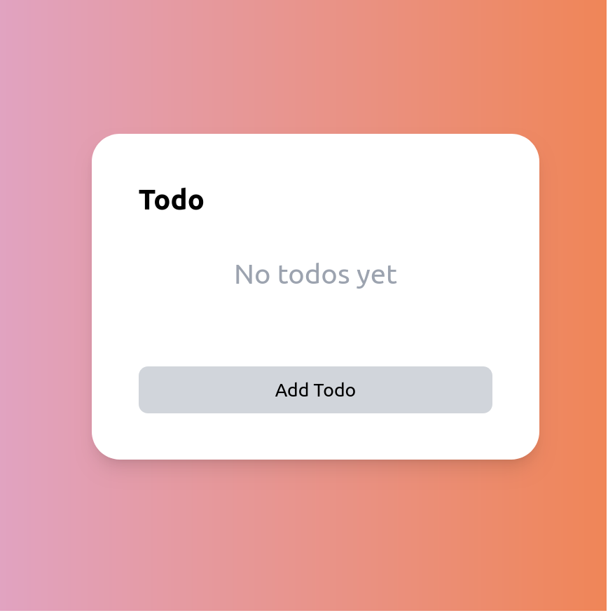

# Simple todo app

Redone in `react`

## Things to do (Base functionality)

- [x] Add empty notes functionality
- [x] Circular checkbox
- [x] Add todo button
- [x] Add todo input textbox
- [x] Make todo list stateful using zustand store
- [x] Add new Todos
- [x] Delete todo
- [x] Store in local storage for persistence

## Extended features

- [x] Option to clear all completed todos
- [x] Option to edit todos

## Features
### Adding a todo

    
    

    

### Check off multiple items and clear the ones that are completed

    
    

### Edit items

    
    

